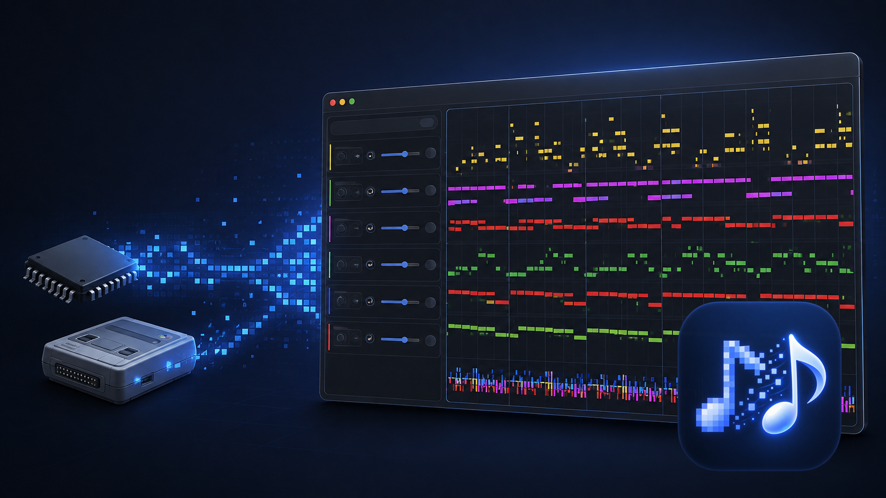
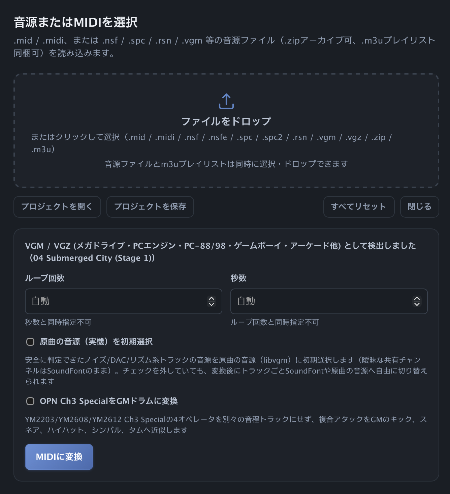
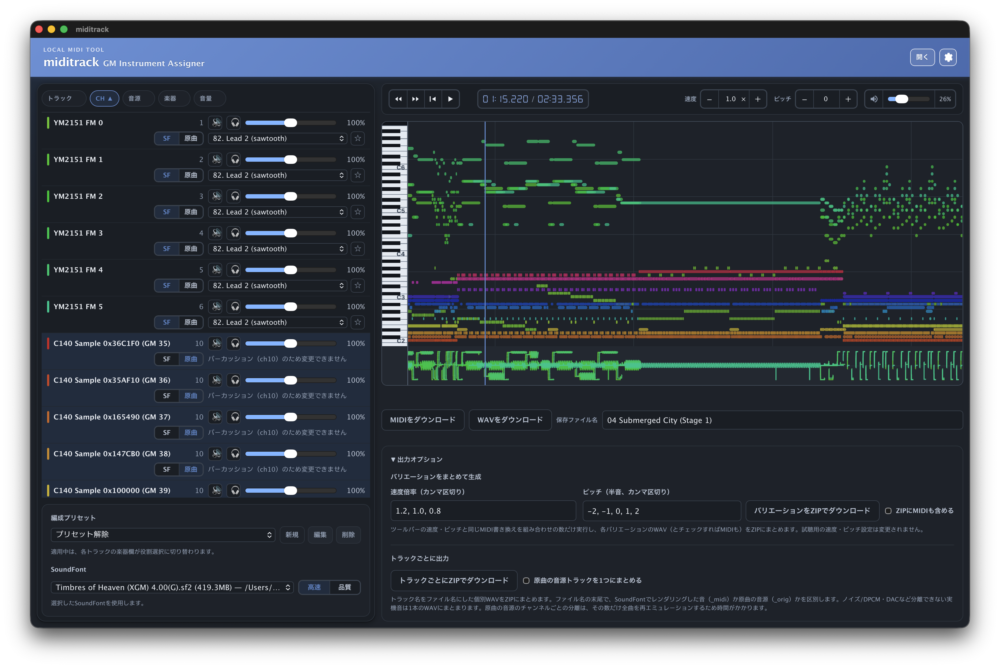
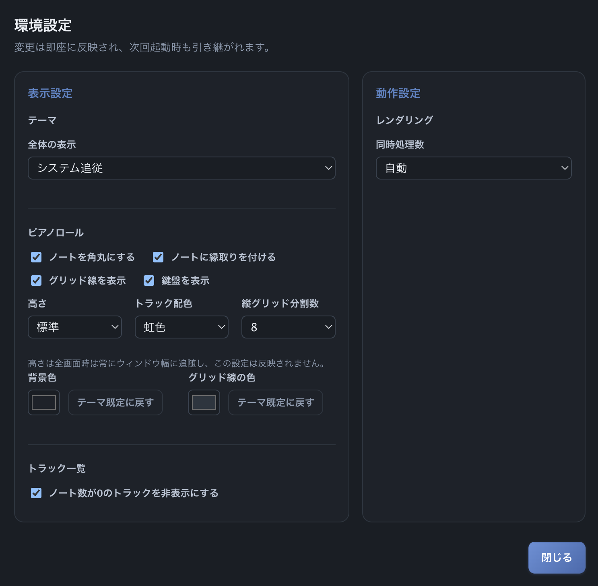

# miditrack

**Under development**

Turn chiptune music — NES (`.nsf`/`.nsfe`), SNES (`.spc`/`.spc2`), or VGM (`.vgm`/`.vgz`) — into editable MIDI and listen to the result in your browser. Everyday use needs no terminal after the one-time setup.

`miditrack` runs only on your Mac. Your source files, MIDI, and rendered audio stay local.



## Quick Start

1. On an Apple Silicon or Intel Mac, download the latest `miditrack.zip` from the [Releases page](https://github.com/Nihondo/miditrack/releases/latest), unzip it, and move `miditrack.app` to `~/Applications` (or `/Applications`). The Python and Node.js runtimes it needs are already bundled inside.

2. Install the runtime dependencies through [Homebrew](https://brew.sh/). If Homebrew itself is not installed yet, install it first.

   ```bash
   # If Homebrew is not installed yet:
   /bin/bash -c "$(curl -fsSL https://raw.githubusercontent.com/Homebrew/install/HEAD/install.sh)"

   brew install fluid-synth ffmpeg rubberband
   ```

   - **FluidSynth** — used to render MIDI to WAV
   - **ffmpeg** — used to mix WAVs together
   - **Rubber Band** — used to change the original audio's speed/pitch

3. Put a General MIDI SoundFont (`.sf2`/`.sf3`) in your user Sound Banks directory. SoundFonts are never bundled or downloaded with the app.

   ```bash
   mkdir -p ~/Library/Audio/Sounds/Banks
   cp /path/to/GeneralMIDI.sf2 ~/Library/Audio/Sounds/Banks/
   ```

4. Double-click `miditrack.app`, or drag it to the Dock — it opens directly in its full-screen editing layout, with the whole app inside its own window and no separate browser tab. See [Launching miditrack from the Dock](#launching-miditrack-from-the-dock) below for details, or [Command-line options](#command-line-options) to start it from a terminal instead.

5. Drop a supported source file or a `.mid` file onto the upload area, edit it, audition it, then download MIDI or WAV.

Building from source instead is also available for contributors — see [miditrack/README.md](miditrack/README.md).

## What You Can Do

- Convert NES, SNES, and VGM/VGZ source files to MIDI. NSF/SPC files with multiple songs offer a song picker.
- Upload several source files, a `.zip` rip pack, or a source file with its `.m3u` playlist. A playlist can supply song titles.
- Reassign General MIDI instruments, set per-track volume or mute, sort the track list, and save favourite instruments and ensemble presets locally.
- Choose **SoundFont** or **Original game sound** for supported tracks. Original sound uses the relevant game SoundFont or chip renderer; SoundFont uses the GM bank you selected.
- Inspect notes in a zoomable piano roll, seek and loop playback, choose a colour/theme/layout preference, and switch to the full-screen editing layout.
- Change the complete song's speed and pitch, save and reopen a `.miditrack` project, and download an edited MIDI or final-quality WAV.
- Generate a ZIP of speed/pitch variations, or export a ZIP containing one WAV per track.

## The Toolkit

| Tool | Purpose | Typical use |
|---|---|---|
| **miditrack** | Browser-based conversion, editing, auditioning, and export | Recommended for everyday work |
| **nsf2midi** | NES/Famicom `.nsf`/`.nsfe` to MIDI | Direct CLI or bundled conversion |
| **spc2midi** | SNES `.spc`/`.spc2` to MIDI and optional game SoundFont | Direct CLI or bundled conversion |
| **vgm2midi** | VGM/VGZ command logs to MIDI | Direct CLI or bundled conversion |
| **miditrack/midi2wav.sh** | MIDI to WAV through FluidSynth | Used by miditrack or directly from a terminal |

## Requirements

- Apple Silicon or Intel Mac, [Homebrew](https://brew.sh/), and an internet connection for the initial download
- The [latest release build](https://github.com/Nihondo/miditrack/releases/latest) of `miditrack.app`, plus [FluidSynth](https://www.fluidsynth.org/), ffmpeg, and Rubber Band installed through Homebrew (`brew install fluid-synth ffmpeg rubberband`)
- Put a custom `.sf2`/`.sf3` in one of these search directories (the first is recommended):
  - `~/Library/Audio/Sounds/Banks`
  - `/Library/Audio/Sounds/Banks`
  - `/opt/homebrew/share/soundfonts` (Apple Silicon Homebrew)
  - `/usr/local/share/soundfonts` (Intel Homebrew)
  - `/opt/homebrew/share/fluid-synth/sf2` (Apple Silicon Homebrew)
  - `/usr/local/share/fluid-synth/sf2` (Intel Homebrew)

The converter binaries, the pinned Python and Node.js runtimes, and the native helper for Original VGM sound (built for both Apple Silicon and Intel) are all bundled inside `miditrack.app`, so ordinary source conversion, Original VGM sound, real-audio stem mixing, per-track export, and speed/pitch changes need no build step. To rebuild the VGM helper after changing its source, install CMake and Ninja, then run `vgm2midi/scripts/build-native.sh`. Intel Macs need an Intel or Universal helper binary.

## Using miditrack

Drop a source file or a `.mid` onto the upload area and work with the tracks and piano roll together on the single main screen. **Save project** downloads a `.miditrack` archive with the editable MIDI, conversion settings, track choices, speed/pitch, loop, and preset. **Open project** restores that state without re-converting the source. Rendered audio and generated ZIPs are not stored in a project.

### Opening Files from Finder

`miditrack.app` can open `.miditrack`, `.mid`, `.midi`, `.nsf`, `.nsfe`, `.spc`, `.spc2`, `.vgm`, `.vgz`, and `.zip` directly from Finder or by dropping files on its Dock icon. Opening a `.miditrack` project restores it; a single MIDI file opens as MIDI; the other formats open as source files. When a current session would be replaced, the app asks for confirmation.

miditrack is the default handler for `.miditrack` projects. For other formats it is an alternate handler so it does not replace your existing player or DAW. In Finder, choose **Get Info → Open with → miditrack → Change All** if you want to make it the default for one of those formats. Existing installations created by `install.sh` are intentionally not overwritten; move the old app aside, then reinstall to refresh Finder's file associations.

### File Selection



Click **Open** in the header to reach this dialog — it also opens automatically before any file is loaded.

**Upload area** — Drag a file onto the dashed area, or click to open a file picker. Accepted: `.mid`, `.midi`, `.nsf`, `.nsfe`, `.spc`, `.spc2`, `.vgm`, `.vgz`, `.zip`, `.m3u`. Drop multiple source files, a ZIP rip pack, or a source file together with an `.m3u` playlist at once. ZIP uploads allow up to 200 files and 512 MiB extracted. ZIPs can contain `.spc` and `.spc2`; a ZIP containing only unsupported files (including `.rsn`) reports that no supported source file was found.

**File and song picker** — When the upload contains multiple convertible sources a file dropdown appears. If the format provides multiple songs (NSF, SPC rip packs) a song picker appears below it.

**Conversion settings** — Appear after format detection and vary by format:

- **VGM/VGZ** — Loop count or duration (mutually exclusive). **Original game sound by default** pre-selects noise/DAC/rhythm tracks for chip rendering; any track can be changed after conversion. **OPN Ch3 Special to GM drums** maps YM2203/YM2608/YM2612 Ch3 Special operators to kick, snare, hi-hat, cymbal, and tom.
- **NSF/NSFE** — Duration in seconds and optional PAL timing.
- **SPC/SPC2** — Loop count.

Click **Convert to MIDI** to start. The dialog also offers **Open project** and **Save project**. After conversion it closes and the main screen below shows the result.

### Main Screen



The track panel and the piano roll stay visible side-by-side at all times. Reopen the file dialog above from the header's **Open** button whenever you want to load or convert another file.

**Track panel (left)** — Each row shows a colour swatch, track name, MIDI channel (CH), source toggle, instrument selector, mute, solo, and volume slider. Click **Track ▲** to sort alphabetically; click again to reverse. MIDI channel 10 (percussion) and multi-channel tracks cannot have their instrument changed.

**SF / Original toggle** — **SF** plays the track through the selected General MIDI SoundFont and honours instrument assignments. **Original** uses a game-derived SoundFont for SPC, or hardware/chip rendering for NSF and VGM. Volume is still adjustable in Original mode. VGM rows sharing a physical hardware channel switch together; ambiguous shared channels are not set to Original automatically. **Cmd-click** (Ctrl-click on Windows/Linux) applies the same choice to every other track that offers the same option.

**Instrument selector** — Choose any GM instrument. The star icon saves it as a favourite for quick access. **Cmd-click** (Ctrl-click) applies that selector's current value to every other editable track (a track left on "Keep unchanged" is unaffected).

**Mute / Solo** — Both affect the rendered preview. **Cmd-click** (Ctrl-click) the mute button to bring every other track to the same mute state (muted or unmuted) at once. Unmuting restores each track's own previously remembered volume rather than a single shared value.

**Ensemble presets** — Save the current combination of instruments and source settings as a named preset. While a preset is active the instrument column switches to a role selector. Presets are stored locally in the browser.

**SoundFont** — Select a `.sf2`/`.sf3` from those found in the standard search directories. **Fast** (22.05 kHz) renders quickly for auditioning; **Quality** (44.1 kHz) matches the WAV download.

**Transport (right, top)** — ◀◀ and ▶▶ step by 5 s per click, ⏮ returns to the start, and ▶/⏸ plays or pauses. Keyboard shortcuts are also available: Space toggles play/pause; Left/Right arrows seek ±1 s; Shift + Left/Right arrows seek ±5 s; Page Up/Page Down seek ±10 s; Home jumps to the start; End jumps to the end; and Cmd+← jumps to the start. The timer shows the current position over the total duration.

**Speed** — Playback rate from 0.1× to 10×. Applies to all subsequent renders and the WAV download.

**Pitch** — Shifts by −24 to +24 semitones. Percussion is never transposed; notes that fall outside MIDI range 0–127 are omitted.

**Volume** — Master level for the session.

**Piano roll (right)** — Displays all tracks as coloured note bars on a vertical keyboard. Scroll to navigate; pinch or use the scroll wheel to zoom. Click to seek.

**Pitch bend lane** — Shows pitch bend data for each track below the note area.

Rendering starts automatically after edits and completed renders are cached for the session. A short delay after the last change updates the preview. If you begin playback while a fresh render is still needed, miditrack can first play a short segment around the current position, then crossfade to the exact full-length WAV when it is ready. Original chip-audio tracks are prepared in the background after conversion so they can join that short preview once ready; the spinner remains visible while the full WAV is still being finished.

**Download MIDI / WAV (bottom)** — Download MIDI saves the edited file with current instrument assignments. Download WAV produces a 44.1 kHz stereo WAV using the current track settings, speed, and pitch. Edit the **filename** field before downloading to set the base name.

**Generate variations in bulk** — Enter comma-separated speed multipliers and semitone values, then click **Download variations as ZIP**. Check **Include MIDI in ZIP** to add the corresponding MIDI file for each combination. Accepts up to 6 speeds, 8 transposes, and 15 total combinations. The audition speed and pitch settings are not changed.

**Export per track** — **Download per track as ZIP** produces one WAV per audible track. Check **Combine original-sound tracks** to merge all original-sound channels into one file, avoiding a full re-render per hardware channel. File names include `_midi` or `_orig` to indicate the render source.

Changing a SoundFont, a track setting, or the filename invalidates previously generated variation and per-track ZIPs; regenerate them after the change.

### Preferences



Open the preferences panel from the header's gear icon. Changes take effect immediately and are preserved across restarts. Fields are grouped into **Display settings** (appearance only) and **Behaviour settings** (how rendering runs).

**Display settings**

**Theme** — **Global display** sets the colour scheme: follow the system setting, light, or dark.

**Piano roll**
- *Round note corners*, *Add note outline*, *Show grid lines*, *Show keyboard* — toggle each element individually.
- *Height* — Sets the piano roll height. On the app version the roll always fills the window height regardless of this setting.
- *Background colour* / *Grid line colour* — Pick a custom colour or reset to the theme default.
- *Track colour scheme* — Controls the saturation of the per-track note colours.
- *Vertical grid divisions* — Number of subdivisions per beat.

**Track list** — *Hide tracks with zero notes* removes empty tracks from the list.

**Behaviour settings**

**Rendering** — *Concurrent render jobs* controls how many render jobs (FluidSynth track splits, chip/hardware channels, and bulk-variation combinations) run at once. **Auto** picks a conservative value from the machine's CPU count; choose a fixed number (1/2/4/8) to override it.

### Limits and behaviour

- MIDI channel 10 is not available for instrument remapping, and multi-channel tracks (including format-0 MIDI) are not editable.
- Auditioning renders then plays audio; it is not a live software synthesizer. Completed renders are cached for the current session.
- `.m3u` title matching is best-effort. A stale or mismatched playlist leaves song titles unchanged instead of failing.

### Command-line options

Run it directly from the app bundle, or create a `miditrack` command once:

```bash
ln -s ~/Applications/miditrack.app/Contents/Resources/project/miditrack/miditrack.sh /opt/homebrew/bin/miditrack
```

```text
miditrack [MIDI_FILE] [--soundfont FILE] [--port PORT] [--no-token] [--no-browser]
```

| Option | Description |
|---|---|
| `MIDI_FILE` | Optional `.mid`/`.midi` file to preload. Upload source files in the browser. |
| `-s, --soundfont FILE` | Default SoundFont at startup. The browser can replace it at any time. |
| `-p, --port PORT` | Fixed port for the Web UI. Omit it (or pass `0`) to pick a free port automatically on every launch. |
| `--no-token` | Disable launch-token authentication. By default a fresh token is issued on every launch and the browser strips it from the URL, so a bookmarked link stops working the next time you start `miditrack`. Combined with a fixed `--port`, this lets you bookmark the plain URL and reopen it every time — but it also means any other process on this Mac can reach the Web UI over `127.0.0.1`, so only use it in a trusted environment. |
| `--no-browser` | Do not open a browser tab automatically. |
| `--version` | Show the version and exit. |

### Saving miditrack as a browser "app"

This is an independent way to run miditrack — it doesn't interact with the Dock app. miditrack can be saved as a PWA (Chrome's "Install app," Safari's "Add to Dock," and similar). A saved app icon always opens `http://127.0.0.1:<port>/` with no token, so combine these three options for that workflow:

- **`--port`** — pins the port so the app icon opens the same URL every time.
- **`--no-token`** — a saved app icon has no way to carry a token in its URL, so this disables token authentication entirely (only use this in a trusted environment).
- **`--no-browser`** — skips the automatic browser tab, since opening from the app icon makes it redundant.

```bash
miditrack --port 51888 --no-token --no-browser
```

Start the server with this command, then open it from the saved app icon. If you save it with Safari's "Add to Dock," give it a name other than "miditrack" — Safari places saved apps directly under `~/Applications/`, the same folder as the Dock app above.

## Using the Command-line Tools

Each converter has its own complete reference. These examples cover the usual case.

### nsf2midi

```bash
nsf2midi song.nsf song.mid
nsf2midi -l song.nsf
```

See [nsf2midi/README.md](nsf2midi/README.md) for MDF instrument definitions, PAL timing, and chip-audio rendering.

### spc2midi

```bash
spc2midi song.spc song.mid
spc2midi --sf2 song.spc song.mid
```

See [spc2midi/README.md](spc2midi/README.md) for SoundFont/DLS export and loop handling.

### vgm2midi

```bash
vgm2midi song.vgz
vgm2midi song.vgz --loops 3
```

See [vgm2midi/README.md](vgm2midi/README.md) for supported chips and advanced options.

### midi2wav.sh

```bash
./miditrack/midi2wav.sh song.mid
./miditrack/midi2wav.sh -S song.mid
./miditrack/midi2wav.sh -s MySound.sf2 -f song.mid
```

`midi2wav.sh` uses FluidSynth's dynamic SoundFont sample loading by default to
avoid loading unused samples before a render. Use `--no-dynamic-sample-loading`
only when comparing output with FluidSynth's eager-loading behaviour.

## Troubleshooting

- **SoundFont not found**: pass `--soundfont`, set `MIDI2WAV_SOUNDFONT`, or place a `.sf2`/`.sf3` in one of the directories listed above.
- **midi2wav not found**: install FluidSynth with `brew install fluid-synth`.
- **A bundled converter was not found**: restore it to its repository location or set `NSF2MIDI_BIN`, `SPC2MIDI_BIN`, or `VGM2MIDI_BIN`.
- **No supported SNES driver found**: the SPC driver is not one of the supported VGMTrans families, so it cannot be converted.
- **No convertible source file found**: the upload or ZIP contains no supported source file.
- **Invalid ZIP file**: the archive is damaged or is not a ZIP file.
- **miditrack requires Flask**: recreate `.venv` using Quick Start.
- **rubberband not found**: install it with `brew install rubberband` before applying non-default speed/pitch to a real-audio stem.

## Acknowledgments

- [NotSoFatso](https://github.com/BleuBleu/FamiStudio) powers the vendored NES/Famicom playback core.
- The original `nsf2midi.exe` 0.14 inspired this macOS reimplementation and its MDF format compatibility.
- [VGMTrans](https://github.com/vgmtrans/vgmtrans) provides the SNES sequence parsers used by `spc2midi`.
- [jkarenko/vgm2midi](https://github.com/jkarenko/vgm2midi) is the upstream fork for `vgm2midi`.
- [FluidSynth](https://www.fluidsynth.org/) renders SoundFont audio.
- [Rubber Band Library](https://breakfastquay.com/rubberband/) synchronizes real-audio stems after speed/pitch changes.
- [DSEG](https://github.com/keshikan/DSEG) provides the bundled playback-timer web font.

## License

| Tool | License |
|---|---|
| miditrack | MIT |
| nsf2midi | GPL-2.0-or-later |
| spc2midi | zlib |
| vgm2midi | MIT (its bundled native helper, `vgm2midi_stems`, statically links [libvgm](https://github.com/ValleyBell/libvgm) and is GPL-2.0-or-later as a whole — see `vgm2midi/NOTICE.md`) |

See each subproject's `README.md`, `LICENSE`, or `NOTICE.md` for full licensing and attribution.
