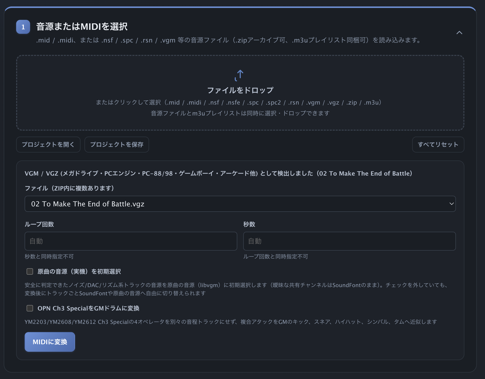
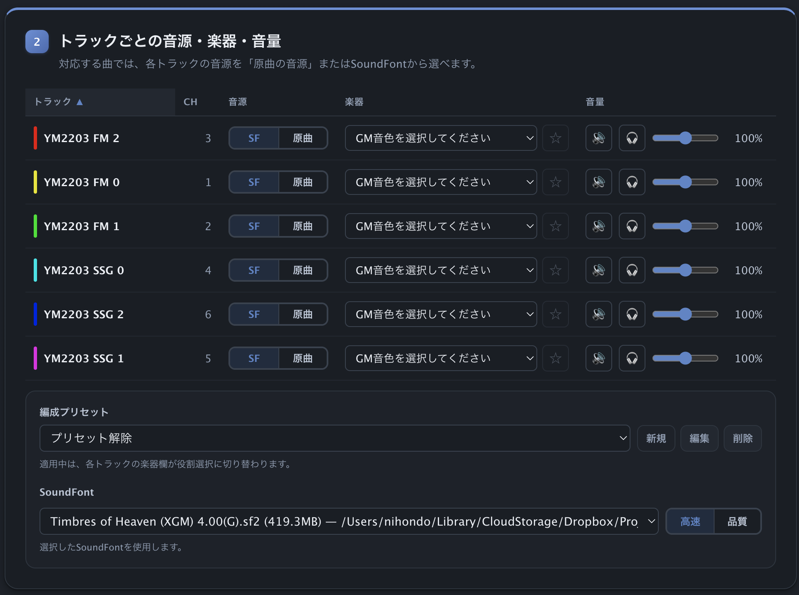
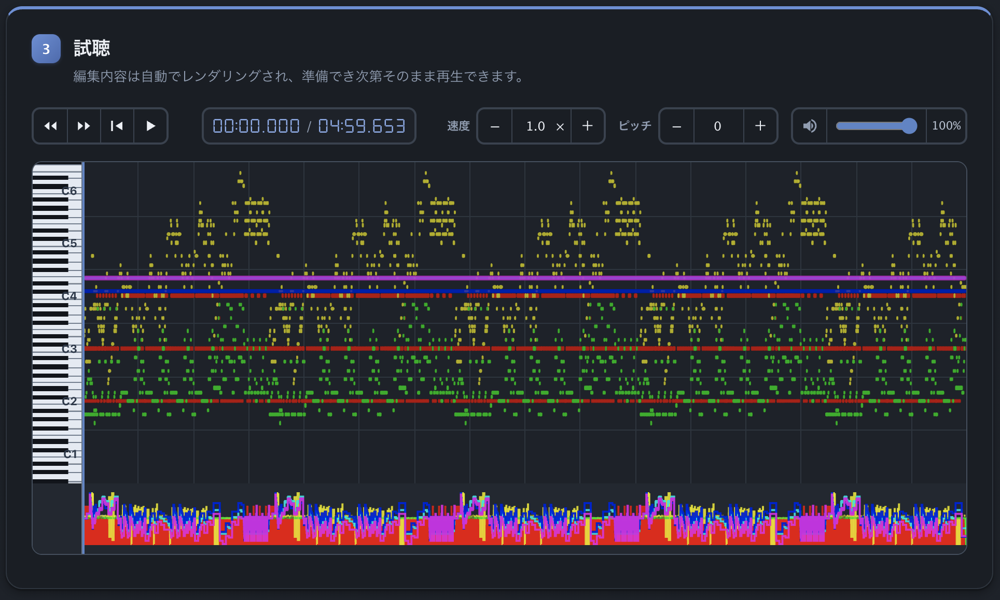
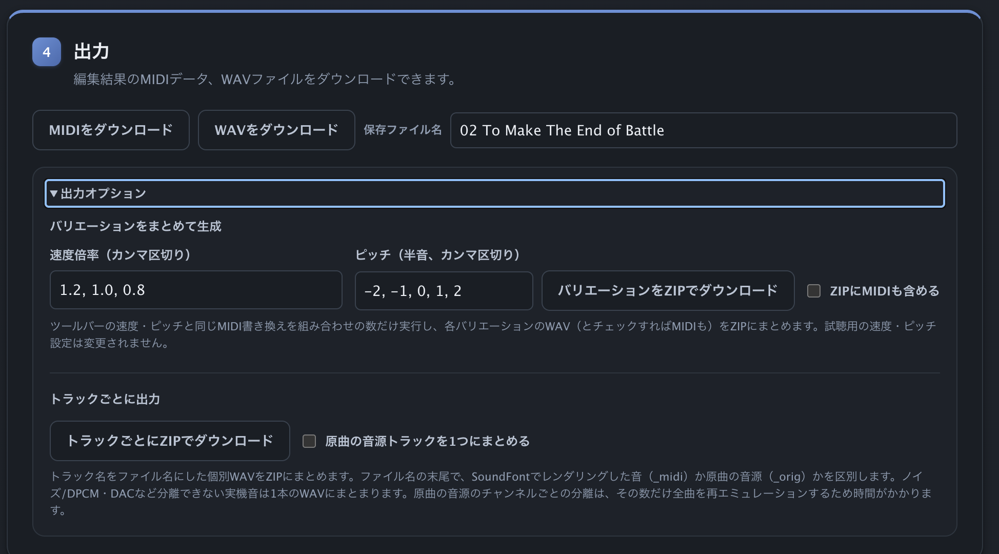
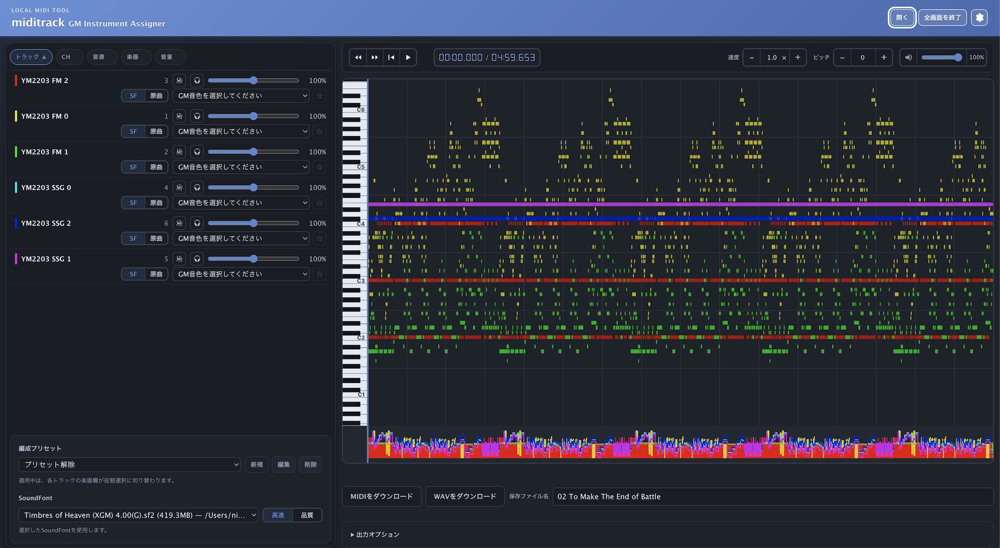

# miditrack

NES（`.nsf`/`.nsfe`）、SNES（`.spc`/`.spc2`/`.rsn`）、VGM（`.vgm`/`.vgz`）のチップチューンを編集可能なMIDIに変換し、ブラウザで試聴できます。一度セットアップすれば、普段の利用にターミナルは必要ありません。

`miditrack`はMac上だけで動作します。音源ファイル、MIDI、レンダリングした音声はすべてローカルに残ります。

## クイックスタート

1. Apple Silicon Macでこのリポジトリをcloneまたはダウンロードし、ディレクトリへ移動します。

   ```bash
   git clone https://github.com/Nihondo/miditrack.git
   cd miditrack
   ```

2. インストーラを実行します。Python、FluidSynth、Node.js、ffmpeg、Rubber Band、Python仮想環境、VGM実行時依存を導入します。

   ```bash
   ./install.sh
   ```

3. 試聴とWAV出力は、初期状態でFluidSynth標準のSoundFontを使えます。カスタムのGeneral MIDI SoundFont（`.sf2`/`.sf3`）を使う場合は、`soundfonts/`へ配置します。

   ```bash
   mkdir -p soundfonts
   cp /path/to/GeneralMIDI.sf2 soundfonts/
   ```

4. インストーラが`/opt/homebrew/bin/miditrack`を作成します。任意のディレクトリからアプリを起動できます。

   ```bash
   miditrack
   ```

5. 対応する音源ファイルまたは`.mid`ファイルをアップロード枠へ置き、編集・試聴してからMIDIまたはWAVをダウンロードします。

## できること

- NES、SNES、VGM/VGZの音源をMIDIへ変換します。複数曲を含むNSF/SPCでは曲を選べます。
- 複数の音源ファイル、`.zip`のリップパック、または音源と`.m3u`プレイリストをまとめてアップロードできます。プレイリストから曲名を取得できます。
- General MIDIの楽器を割り当て、トラック別の音量・ミュートを設定し、トラック一覧を並べ替え、よく使う楽器とアンサンブルプリセットをローカルに保存できます。
- 対応トラックでは**SoundFont**または**原曲の音源**を選べます。原曲の音源はゲーム由来のSoundFontまたはチップレンダラーを使い、SoundFontは選択したGMバンクを使います。
- 拡大可能なピアノロールでノートを確認し、再生位置・ループを指定し、色・テーマ・レイアウトを選び、全画面編集レイアウトへ切り替えられます。
- 曲全体の速度・ピッチを変更し、`.miditrack`プロジェクトを保存・再読込して、編集済みMIDIまたは高品質WAVをダウンロードできます。
- 速度・ピッチのバリエーションZIP、またはトラックごとにWAVを含むZIPを生成できます。

## ツール構成

| ツール | 役割 | 主な使い方 |
|---|---|---|
| **miditrack** | ブラウザでの変換、編集、試聴、出力 | 普段の利用に推奨 |
| **nsf2midi** | NES／ファミコンの`.nsf`/`.nsfe`をMIDIへ変換 | CLIから直接、またはmiditrackの変換 |
| **spc2midi** | SNESの`.spc`/`.spc2`/`.rsn`をMIDIと任意のゲーム用SoundFontへ変換 | CLIから直接、またはmiditrackの変換 |
| **vgm2midi** | VGM/VGZのコマンドログをMIDIへ変換 | CLIから直接、またはmiditrackの変換 |
| **miditrack/midi2wav.sh** | FluidSynthを使ってMIDIをWAVへ変換 | miditrackから使用、またはターミナルで直接実行 |

## 必要環境

- Apple Silicon Mac、[Homebrew](https://brew.sh/)、初回パッケージ取得用のインターネット接続
- `./install.sh`でPython 3.10以上、[FluidSynth](https://www.fluidsynth.org/)、Node.js、ffmpeg、Rubber Bandを導入し、必要なPython／Node.js環境を作成
- 初期状態ではFluidSynth標準のGeneral MIDI SoundFontを使います。カスタムの`.sf2`/`.sf3`を追加する場合は、`<リポジトリ>/soundfonts`（存在しなければ作成）または次の探索先へ配置します。
  - `<リポジトリ>/soundfonts`
  - `~/Library/Audio/Sounds/Banks`
  - `/opt/homebrew/share/soundfonts`
  - `/Library/Audio/Sounds/Banks`
  - `/opt/homebrew/share/fluid-synth/sf2`

インストーラはHomebrewの式を1件ずつ処理します。同名の式が別tapに存在して競合した場合も、Homebrewのエラーは表示したままセットアップを続行します。最後に必要なコマンドが`PATH`上で見つからない場合だけ停止します。

コンバーターのバイナリと、Apple Silicon向けVGM原曲音源のネイティブヘルパーは同梱されているため、通常の音源変換とVGM原曲音源にビルドは不要です。実音声ステムのミックス、トラック別出力、速度／ピッチ変更に必要なffmpegとRubber Bandも標準インストーラに含まれます。ヘルパーのソースを変更して再ビルドする場合だけ、CMakeとNinjaを導入してから`vgm2midi/scripts/build-native.sh`を実行してください。Intel MacではIntel版またはUniversal版のヘルパーバイナリが必要です。

## miditrackの使い方

音源ファイルまたは`.mid`をアップロード枠へ置き、4つの画面を順に操作します。**プロジェクトを保存**は編集可能なMIDI・変換設定・トラック選択・速度／ピッチ・ループ・プリセットを`.miditrack`アーカイブとしてダウンロードします。**プロジェクトを開く**はその状態を復元します。音源の再変換は不要です。レンダー済み音声と生成済みZIPは意図的にプロジェクトへ保存しません。

### 画面1 · ファイル選択



**アップロード枠** — 点線枠へファイルをドラッグするか、クリックしてファイルピッカーを開きます。対応形式: `.mid` / `.midi` / `.nsf` / `.nsfe` / `.spc` / `.spc2` / `.rsn` / `.vgm` / `.vgz` / `.zip` / `.m3u`。複数の音源ファイル、ZIPリップパック、音源と`.m3u`プレイリストをまとめてドロップできます。ZIPはファイル数200件まで、展開後512MiBまでです。`.m3u`プレイリストを音源と一緒に読み込むと曲名を取得できます。

**ファイル・曲のピッカー** — 変換可能な音源が複数ある場合はファイルのドロップダウンが表示されます。複数曲を含む形式（NSF、SPCリップパック）ではその下に曲ピッカーが表示されます。

**変換設定** — フォーマット検出後に表示されます。

- **VGM/VGZ** — ループ回数または秒数（同時指定不可）。**原曲の音源（実機）を初期選択**はノイズ・DAC・リズム系トラックをチップレンダリングに設定します（変換後も個別に切り替え可能）。**OPN Ch3 SpecialをGMドラムに変換**はYM2203/YM2608/YM2612 Ch3 Specialオペレータをキック・スネア・ハイハット・シンバル・タムへ近似します。
- **NSF/NSFE** — 秒数と任意のPALタイミング。
- **SPC/SPC2/RSN** — ループ回数。

**MIDIに変換**をクリックして変換を開始します。変換後はMIDIをアップロードした場合と同じように操作できます。

### 画面2 · トラック



**トラック一覧** — 各行にはカラースウォッチ、トラック名、MIDIチャンネル（CH）、音源トグル、楽器セレクター、ミュート、ソロ、音量スライダーが並びます。**トラック▲**をクリックするとアルファベット順に並べ替え、もう一度クリックすると逆順になります。MIDIチャンネル10（パーカッション）と複数チャンネルにまたがるトラックは楽器を変更できません。

**SF / 原曲 トグル** — **SF**は選択したGeneral MIDI SoundFontでトラックを再生し、楽器選択も反映します。**原曲**はSPCではゲーム由来のSoundFont、NSF/VGMではハードウェア・チップレンダリングを使用します。原曲モードでも音量は調整できます。物理チャンネルを共有するVGMの行はまとめて切り替わります。曖昧な共有チャンネルは原曲として自動選択されません。

**楽器セレクター** — General MIDIの楽器を選択します。星アイコンでお気に入りに登録できます。

**ミュート / ソロ** — どちらもレンダリングされるプレビューに反映されます。

**編成プリセット** — 現在の楽器と音源の設定を名前を付けて保存できます。プリセット適用中は楽器欄が役割セレクターに切り替わります。プリセットはブラウザにローカル保存されます。

**SoundFont** — 標準の探索先で見つかった`.sf2`/`.sf3`から選択します。**高速**（22.05kHz）は試聴用の速いレンダリング、**品質**（44.1kHz）はWAVダウンロードと同じ内容です。

### 画面3 · 試聴



**トランスポート** — ◀◀は5秒巻き戻し、▶▶は5秒スキップ、⏮は先頭に戻る、▶/⏸は再生・一時停止です。タイマーは現在位置と全体時間を表示します。

**速度** — 再生倍率を0.1〜10倍で設定します。以降のすべてのレンダリングとWAVダウンロードへ反映されます。

**ピッチ** — −24〜+24半音でシフトします。パーカッションは移調されません。MIDIの0〜127の範囲外になるノートは除外されます。

**音量** — セッション全体のマスター音量です。

**ピアノロール** — 全トラックのノートをカラーのバーで縦鍵盤上に表示します。横スクロールで移動、ピンチまたはスクロールホイールでズームできます。クリックでシークします。

**ピッチベンド** — 各トラックのピッチベンドデータをノートエリア下部に表示します。

レンダリングは編集後に自動で開始し、完成済みレンダーはセッション内でキャッシュされます。最後の変更から短い待機時間の後にプレビューを更新します。

### 画面4 · 出力



**MIDIをダウンロード / WAVをダウンロード** — MIDIをダウンロードは現在の楽器割り当てを反映した編集済みMIDIを保存します。WAVをダウンロードは現在のトラック設定・速度・ピッチで44.1kHzステレオWAVを生成します。**保存ファイル名**欄で基本ファイル名を変更できます。

**バリエーションをまとめて生成** — 速度倍率と半音値をカンマ区切りで入力し、**バリエーションをZIPでダウンロード**をクリックします。**ZIPにMIDIも含める**で各組み合わせのMIDIファイルも追加できます。速度6個・移調8個・組み合わせ合計15件までです。試聴中の速度・ピッチは変更されません。

**トラックごとに出力** — **トラックごとにZIPでダウンロード**で音があるトラックごとにWAVを作成します。**原曲の音源トラックを1つにまとめる**をオンにすると、原曲の音源チャンネルを1ファイルにまとめてハードウェアチャンネルごとのフルレンダリングを省けます。ファイル名末尾の`_midi`または`_orig`でレンダー元を区別します。

SoundFont、トラック設定、出力ファイル名を変更すると、生成済みのバリエーションZIPとトラック別ZIPは無効になります。変更後に再生成してください。

### 全画面モード



全画面モードでは、トラックパネルとピアノロールが1画面に並んで表示されます。ヘッダーの**全画面**をクリックで切り替え、**全画面を終了**で通常表示へ戻ります。

**トラックパネル（左）** — 画面2と同じ操作ができます。音源トグル、楽器、ミュート、ソロ、音量をトラックごとに設定できます。編成プリセットとSoundFontセレクターはリスト下部に固定されます。

**ピアノロール（右）** — 画面3と同じ内容です。トランスポートバーと速度・ピッチのコントロールは上部に配置されます。

**出力バー（下部）** — MIDIとWAVのダウンロードボタンおよび出力オプションパネルが最下部に表示され、画面4の代わりに使えます。

### 制限と挙動

- MIDIチャンネル10は楽器変更の対象外です。複数チャンネルにまたがるトラック（format 0 MIDIを含む）も編集できません。
- 試聴はレンダリング後に再生する方式で、ライブソフトウェアシンセではありません。完成済みレンダーはセッション内でキャッシュされます。
- `.m3u`の曲名対応付けはベストエフォートです。古い、または対応付けできないプレイリストはエラーにせず、曲名を変えません。

### コマンドラインオプション

```text
miditrack [MIDI_FILE] [--soundfont FILE] [--no-browser]
```

| オプション | 説明 |
|---|---|
| `MIDI_FILE` | 起動時に読み込む任意の`.mid`/`.midi`ファイル。音源ファイルはブラウザからアップロードします。 |
| `-s, --soundfont FILE` | 起動時の既定SoundFont。ブラウザからいつでも変更できます。 |
| `--no-browser` | ブラウザタブを自動で開きません。 |
| `--version` | バージョンを表示して終了します。 |

## コマンドラインツールを使う

各コンバーターには完全なリファレンスがあります。ここでは一般的な例だけを示します。

### nsf2midi

```bash
nsf2midi song.nsf song.mid
nsf2midi -l song.nsf
```

MDF音色定義、PALタイミング、チップ音声レンダリングは[nsf2midi/README.md](nsf2midi/README_ja.md)を参照してください。

### spc2midi

```bash
spc2midi song.rsn song.mid
spc2midi -s 12 --sf2 song.rsn song.mid
```

SoundFont/DLS出力とループ処理は[spc2midi/README.md](spc2midi/README_ja.md)を参照してください。

### vgm2midi

```bash
vgm2midi song.vgz
vgm2midi song.vgz --loops 3
```

対応チップと高度なオプションは[vgm2midi/README.md](vgm2midi/README_ja.md)を参照してください。

### midi2wav.sh

```bash
./miditrack/midi2wav.sh song.mid
./miditrack/midi2wav.sh -S song.mid
./miditrack/midi2wav.sh -s MySound.sf2 -f song.mid
```

## トラブルシューティング

- **SoundFontが見つからない**: `--soundfont`を指定する、`MIDI2WAV_SOUNDFONT`を設定する、または上記のいずれかのディレクトリへ`.sf2`/`.sf3`を配置します。
- **midi2wavが見つからない**: `brew install fluid-synth`でFluidSynthをインストールします。
- **同梱コンバーターが見つからない**: リポジトリ内の元の場所へ戻すか、`NSF2MIDI_BIN`、`SPC2MIDI_BIN`、`VGM2MIDI_BIN`を設定します。
- **対応するSNESドライバが見つからない**: そのSPCドライバは対応するVGMTransのファミリーではないため、変換できません。
- **変換可能な音源ファイルが見つからない**: アップロードまたはZIPに対応する音源ファイルが含まれていません。
- **ZIPファイルが不正**: アーカイブが破損しているか、ZIPではありません。
- **miditrackにはFlaskが必要**: クイックスタートの手順で`.venv`を作り直します。
- **rubberbandが見つからない**: 実音声ステムへ既定値以外の速度・ピッチを適用する前に、`brew install rubberband`でインストールします。

## 謝辞

- [NotSoFatso](https://github.com/BleuBleu/FamiStudio)は、同梱するNES／ファミコン再生コアの基盤です。
- オリジナルの`nsf2midi.exe` 0.14は、このmacOS再実装とMDF形式互換の着想元です。
- [VGMTrans](https://github.com/vgmtrans/vgmtrans)は、`spc2midi`が使うSNESシーケンスパーサーを提供します。
- [jkarenko/vgm2midi](https://github.com/jkarenko/vgm2midi)は、`vgm2midi`の上流フォークです。
- [FluidSynth](https://www.fluidsynth.org/)は、SoundFont音声をレンダリングします。
- [Rubber Band Library](https://breakfastquay.com/rubberband/)は、速度・ピッチ変更後の実音声ステムを同期します。
- [DSEG](https://github.com/keshikan/DSEG)は、同梱する再生タイマー用Webフォントを提供します。

## ライセンス

| ツール | ライセンス |
|---|---|
| miditrack | MIT |
| nsf2midi | GPL-2.0-or-later |
| spc2midi | zlib（VGMTransのLGPL-3.0コンポーネントを含む） |
| vgm2midi | MIT |

完全なライセンスと帰属は、各サブプロジェクトの`README.md`、`LICENSE`、`NOTICE.md`を参照してください。
